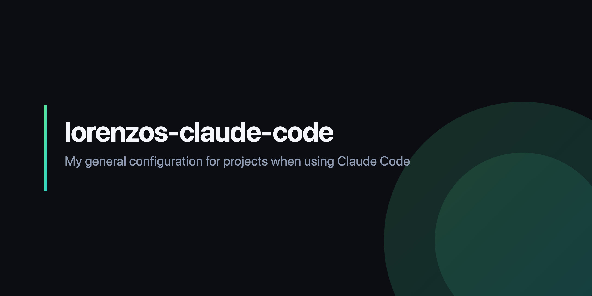

# Lorenzo's Claude Code Plugin

<p align="center">
  
</p>

[](LICENSE)
[](https://nodejs.org)

**Stack-focused Claude Code plugin for Next.js + React + Supabase.**

Scaffolds components, API routes, hooks, Supabase types, and Edge Functions. Composes with [superpowers](https://github.com/obra/superpowers) — install both for the full toolkit.

<!-- AUTOGEN:counts -->
**17 commands** · **6 agents** · **14 skills** · **14 hooks** · **2 monitors**
<!-- /AUTOGEN:counts -->

---

## Pairs with superpowers

This plugin focuses on **stack-specific scaffolding**. Process discipline (TDD, debugging, planning, code review workflows) lives in [superpowers](https://github.com/obra/superpowers). The two compose:

- **superpowers** handles *how* to work — brainstorming, writing plans, executing them, debugging, verifying.
- **lorenzos-claude-code** handles *what* to build — concrete Next.js / React / Supabase scaffolds.
- The `skill-activator` hook (in this plugin) scores incoming prompts across keywords, patterns, file paths, directories, and intents, then routes to the right skill — whether that skill lives in this plugin or in superpowers.

---

## Install

```bash
npm install -g @gr8monk3ys/claude-code-plugin
lcc install
lcc doctor
```

Or, from inside Claude Code:

```text
/plugin marketplace add https://github.com/gr8monk3ys/skills
/plugin install lorenzos-claude-code
```

---

## Commands

<!-- AUTOGEN:commands -->
| Name | Description |
| --- | --- |
| `/action-new` | Scaffold a Next.js 15 Server Action with Zod validation and typed results |
| `/api-new` | Create a new Next.js API route with validation, error handling, and TypeScript |
| `/api-test` | Test API endpoints with automated test generation |
| `/automerge` | PR automation - validate, merge, cleanup, and sync |
| `/babysit` | Watch a PR in a loop and auto-fix CI failures and review comments |
| `/component-new` | Create a new React component with TypeScript and modern best practices |
| `/deploy` | Generate deployment configurations and workflows |
| `/edge-function-new` | Create a new Supabase Edge Function with Deno |
| `/fixissue` | End-to-end issue resolution - fetch, branch, fix, test, commit, PR, close |
| `/hook-new` | Create custom React hooks with TypeScript and best practices |
| `/lint` | Run linting and fix code quality issues |
| `/page-new` | Create a new Next.js page with App Router best practices |
| `/review` | RIPER Review Phase - Quality gates before considering work complete |
| `/rls-new` | Scaffold Supabase Row Level Security policies from a description, with tests |
| `/test-new` | Generate test files for Jest, Vitest, or Playwright |
| `/types-gen` | Generate TypeScript types from Supabase database schema |
| `/verify` | Run comprehensive 6-phase verification loop (build, types, lint, tests, security, diff) |
<!-- /AUTOGEN:commands -->

## Agents

<!-- AUTOGEN:agents -->
| Name | Description |
| --- | --- |
| `backend-architect` | Design reliable backend systems with focus on data integrity, security, and fault tolerance |
| `build-error-resolver` | Use when fixing TypeScript errors, build failures, compilation issues, type mismatches, or "tsc --noEmit" errors. Activates on build failures, type errors, or compilation problems requiring quick minimal fixes. |
| `code-reviewer` | Use this agent when reviewing code for quality, performing PR reviews, or analyzing code for security vulnerabilities, performance issues, or style problems. Activates on code review requests or quality assessments. |
| `devops-engineer` | Design CI/CD pipelines, infrastructure as code, and deployment strategies for reliable software delivery |
| `frontend-architect` | Create accessible, performant user interfaces with focus on user experience and modern frameworks |
| `test-strategist` | Use this agent when planning test strategies, analyzing test coverage, or designing comprehensive testing approaches. Activates on test planning, coverage analysis, or when asking about what to test. |
<!-- /AUTOGEN:agents -->

## Skills

<!-- AUTOGEN:skills -->
| Name | Description |
| --- | --- |
| `api-development` | WHEN to auto-invoke: Creating API routes, building endpoints, adding route.ts files, implementing REST/GraphQL APIs, adding authentication to APIs, rate limiting, API validation with Zod, handling HTTP methods (GET/POST/PUT/DELETE). |
| `ask-lorenzo` | Ask which command or skill in this plugin fits your situation. A router over everything user-reachable — scaffolding, quality gates, delivery, and the ported workflow skills. |
| `background-automation` | WHEN to auto-invoke: Setting up recurring or self-paced tasks, watching CI or deploys, babysitting pull requests, configuring monitors, running long jobs in the background, scheduling check-ins, polling for a condition, or wiring Claude Code on the web/cloud sessions and PR activity subscriptions. |
| `database-operations` | WHEN to auto-invoke: Database schema design, creating migrations, writing SQL queries, query optimization, Supabase operations, Prisma/Drizzle schema changes, PostgreSQL tasks, RLS policies, indexes. |
| `domain-modeling` | Build and sharpen a project's domain model. Use when discussing codebase terminology, writing or editing a CONTEXT.md, or recording or editing an ADR. |
| `frontend-development` | WHEN to auto-invoke: Creating UI components, building React/Vue/Svelte components, Next.js pages, styling with Tailwind/CSS, state management setup, form handling, accessibility improvements, client-side interactivity. |
| `handoff` | Compact the current conversation into a handoff document for another agent to pick up. |
| `prototype` | Build a throwaway prototype to answer a design question. Use when the user wants to sanity-check whether a state model or logic feels right, or explore what a UI should look like. |
| `research` | Investigate a question against high-trust primary sources and capture the findings as a Markdown file in the repo. Use when the user wants a topic researched, docs or API facts gathered, or reading legwork delegated to a background agent. |
| `resolving-merge-conflicts` | Use when you need to resolve an in-progress git merge/rebase conflict. |
| `to-questionnaire` | Turn a decision you can't fully answer into a questionnaire for someone else to fill in. |
| `wait-what` | Stop. That last message did not land — re-pitch it. |
| `wizard` | Generate an interactive bash wizard that walks a human through steps only they can perform. Use when provisioning infrastructure, setting up credentials or CI secrets, walking an unfamiliar third-party dashboard, or running a one-off migration or cutover. Don't invoke this for steps the agent can perform itself. |
| `writing-for-agents` | Writing documents for agents. Use when creating or editing skills, or modifying AGENTS.md or CLAUDE.md. |
<!-- /AUTOGEN:skills -->

## Hooks

<!-- AUTOGEN:hooks -->
| Name | Description |
| --- | --- |
| `auto-format` |  |
| `block-sensitive-files` |  |
| `notify-completion` |  |
| `permission-request` |  |
| `post-tool-failure` |  |
| `pre-compact` |  |
| `session-end` |  |
| `session-start` |  |
| `setup` |  |
| `skill-activator` |  |
| `status-line` |  |
| `subagent-start` |  |
| `subagent-stop` |  |
| `validate-json` |  |
<!-- /AUTOGEN:hooks -->

## Monitors

Background watchers (`.claude/monitors/monitors.json`) stream long-running command output into the session as notifications — surfacing type and runtime errors before they reach CI. They are example defaults; adjust the commands and log paths to match your project.

<!-- AUTOGEN:monitors -->
| Name | Description |
| --- | --- |
| `next-dev` | Surfaces Next.js dev-server runtime errors and failed compilations |
| `typecheck-watch` | Streams TypeScript type errors as you edit, before they reach CI |
<!-- /AUTOGEN:monitors -->

## MCP Servers

| Server | Purpose |
| --- | --- |
| `context7` | Library documentation lookup |
| `memory` | Cross-session memory |
| `playwright` | Browser automation |
| `github` | PRs, issues, repository operations |

---

## Skill auto-routing

The `skill-activator` hook scores prompts across five dimensions with weighted confidence:

| Dimension | Weight |
| --- | --- |
| Keywords | 2 |
| Patterns | 3 |
| File paths | 4 |
| Directories | 5 |
| Intents | 4 |

At ≥8 points the matching skill is auto-activated; at ≥5 points it is suggested. Rules live in `.claude/hooks/skill-rules.json`. The activator surfaces both this plugin's stack skills and any superpowers skills that match — one routing layer for the whole toolkit.

---

## Requirements

- Claude Code 2.0.13+
- Node.js 18+

## License

GPL-3.0 — see [LICENSE](LICENSE).

## Contributing

See [ROADMAP.md](ROADMAP.md) for upcoming work.
